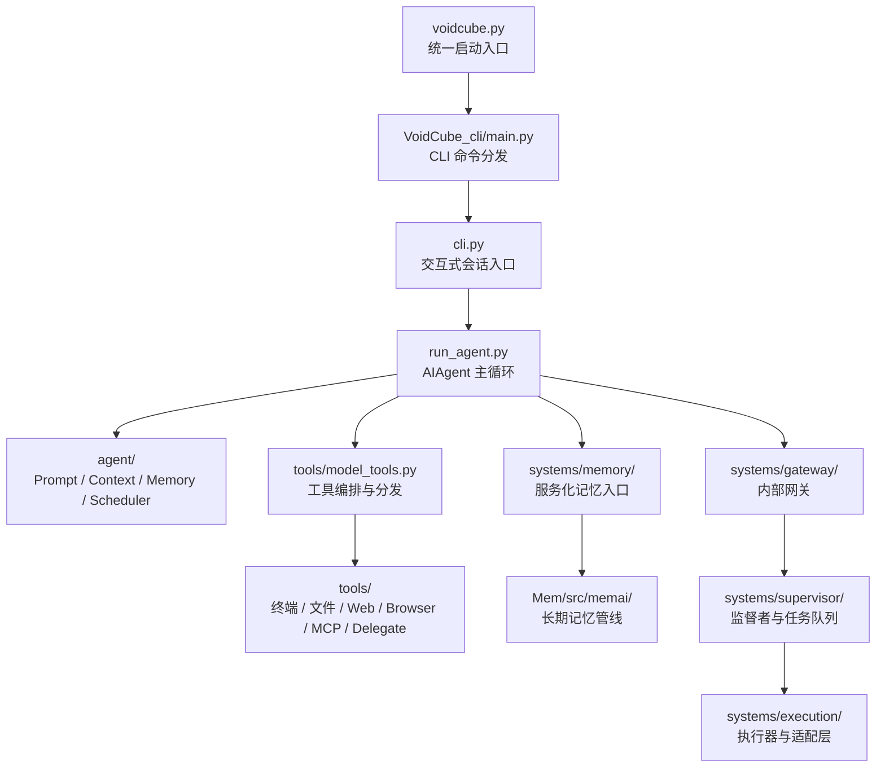
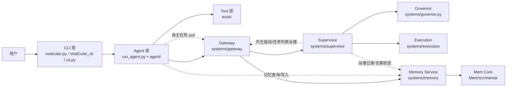

# VoidCube 项目文件架构说明

更新日期：2026-07-03

## 1. 文档目的

这份文档基于当前仓库实际文件结构整理，不直接复述旧文档中的历史结构描述，目标是回答四件事：

1. 项目真实入口在哪里
2. 各目录分别承担什么职责
3. 运行时文件和源码文件如何分层
4. 新人进入仓库时应先看哪些文件

说明：

- 统计口径以当前仓库内可维护文件为准，忽略 `.git`、`.venv`、`__pycache__`、`.pytest_cache` 等缓存目录
- 下文中的树状图为“开发关注版”，突出关键目录与代表文件，不逐一展开全部 400+ 文件

## 2. 仓库总体判断

VoidCube 不是单一脚本项目，而是一个多层协作仓库，结构上可以拆成 7 层：

1. 启动与入口层：`voidcube.py`、`cli.py`、`run_agent.py`
2. CLI 表现层：`VoidCube_cli/`
3. Agent 能力层：`agent/`
4. Tool 执行层：`tools/`
5. Services 服务层：`systems/`
6. 长期记忆子项目：`Mem/`
7. 验证与文档层：`tests/`、`docs/`、`papers/`

当前仓库的真实运行链路更接近：

```text
voidcube.py
  -> 自动拉起 Memory / Gateway / Supervisor
  -> 委托给 VoidCube_cli/main.py
      -> 分发 CLI 命令与交互模式
          -> cli.py
              -> run_agent.py
                  -> agent/* + tools/*
```

这和 README 里较早期的“单 CLI + 单 Agent”描述相比，已经明显演进成了“CLI 门面 + 服务化母体 + 独立记忆子系统”的结构。

当前基线还需要补充三点：

- 监督者目标语义是全天候运行；`AUTO` 只是当前仍保留的临时启停门控，不再限制主 CLI 输入，也不阻断用户与主 Agent 交互。
- Agent 自主任务采用 pull 形态：监督者管理任务列表，Agent 通过自主任务执行通道拉取 `self_learning` / `body_improvement`。
- gateway 的 agent scene 已按 `user_chat` / `supervisor_task` 双泳道隔离；这和身体槽位 `active` / `shell` 是两层不同的“槽”。

## 3. Mermaid 架构图

### 3.1 主调用链



### 3.2 服务层协作关系



### 3.3 图示解读

- 第一张图强调启动与调用路径，适合定位“从哪里进、往哪里走”
- 第二张图强调服务边界，适合定位“谁负责执行、谁负责治理、谁负责长期记忆”
- `Mem/` 是独立子项目，但运行时主要通过 `systems/memory/` 暴露给主系统

## 4. 顶层目录分层

截至当前版本，按 `rg --files` 统计的主要目录规模如下：

| 目录 | 可维护文件数 | 角色 |
| --- | ---: | --- |
| `skills/` | 113 | 技能市场/技能模板与引用资料 |
| `Mem/` | 101 | 独立长期记忆子项目 |
| `tools/` | 73 | 工具定义、注册、执行后端 |
| `VoidCube_cli/` | 60 | CLI 主程序、配置、UI、模型/Provider 管理 |
| `systems/` | 36 | Gateway、Supervisor、Memory Service、Execution |
| `tests/` | 36 | 主仓回归测试 |
| `agent/` | 31 | Agent 内部能力模块 |
| 根目录文件 | 26 | 启动器、配置、脚本、说明 |
| `VoidCube_core/` | 8 | 通用常量、状态、日志、i18n |
| `presets/` | 7 | 运维预设模板 |
| `docs/` | 9 | 项目级架构文档 |
| `plugins/` | 4 | 插件入口，当前以 memory 插件为主 |

## 5. 开发关注版文件架构图

```text
VoidCube/
├─ voidcube.py                     # 统一入口；自动拉起守护服务后委托 CLI
├─ cli.py                          # 交互式终端入口与会话 UI
├─ run_agent.py                    # AIAgent 主编排器，串起模型、工具、记忆
├─ pyproject.toml                  # 打包配置，暴露 voidcube/vc 命令
├─ config.yaml                     # 项目配置样例/默认配置
├─ pytest.ini                      # pytest 配置
├─ README.md                       # 对外说明，部分结构描述已落后于当前代码
├─ papers/
│  └─ the_tripartite_model_of_ai_individuation.md
├─ docs/
│  ├─ voidcube架构基线.md
│  ├─ 全链条报告.md
│  ├─ 内生驱动问题清单.md
│  ├─ 内生驱动核心设计.md
│  ├─ CLI展示与gateway双槽设计.md
│  ├─ endogenous-drive-body-upgrade-gap.md
│  ├─ mem-two-tier-renovation-plan.md
│  ├─ mem-llm-first-redesign.md
│  └─ 项目文件架构说明.md
├─ VoidCube_core/                  # 低层共享能力
│  ├─ constants.py                 # 全局常量、路径、环境判断
│  ├─ logging.py                   # 统一日志初始化
│  ├─ state.py                     # 状态读写
│  ├─ i18n.py                      # 基础国际化
│  └─ utils.py
├─ VoidCube_cli/                   # CLI 子系统
│  ├─ main.py                      # 完整命令行分发入口
│  ├─ config.py                    # CLI 配置加载
│  ├─ env_loader.py                # .env 加载
│  ├─ providers.py                 # 模型提供商定义
│  ├─ models.py                    # 模型元数据
│  ├─ model_switch.py              # 模型切换逻辑
│  ├─ commands.py                  # 命令处理
│  ├─ cli_ui.py                    # 终端 UI 组件
│  ├─ cli_output.py                # 输出封装
│  ├─ cli_handlers.py              # 交互事件处理
│  ├─ status.py                    # 状态展示
│  ├─ profiles.py                  # Profile 管理
│  ├─ plugins.py                   # CLI 插件接入
│  ├─ ops/
│  │  ├─ serve.py                  # 服务启停
│  │  ├─ dashboard.py              # 状态面板
│  │  ├─ executor.py               # 执行器入口
│  │  └─ provider.py
│  ├─ tools/                       # CLI 自带工具包装
│  └─ locales/
│     ├─ zh_CN.json
│     └─ en_US.json
├─ agent/                          # Agent 内部能力模块
│  ├─ agent_initializer.py         # Agent 初始化装配
│  ├─ prompt_builder.py            # 系统提示构建
│  ├─ memory_manager.py            # 记忆上下文注入
│  ├─ context_compressor.py        # 上下文压缩
│  ├─ tool_scheduler.py            # 工具调度与并发策略
│  ├─ model_metadata.py            # 模型元信息/上下文长度估计
│  ├─ smart_model_routing.py       # 模型路由策略
│  ├─ subagent_display.py          # 子代理展示
│  └─ usage_pricing.py             # token/成本统计
├─ tools/                          # 真正的工具实现层
│  ├─ registry.py                  # 工具注册表
│  ├─ model_tools.py               # 工具编排与对外 API
│  ├─ toolsets.py                  # 工具集分组
│  ├─ terminal_tool.py             # 终端执行
│  ├─ file_tools.py                # 文件读写工具
│  ├─ browser_tool.py              # 浏览器自动化
│  ├─ web_tools.py                 # Web 搜索/抓取
│  ├─ memory_tool.py               # 记忆工具
│  ├─ delegate_tool.py             # 委派/子任务工具
│  ├─ mcp_tool.py                  # MCP 接入
│  ├─ ops_register.py              # 运维原语注册
│  ├─ path_security.py             # 路径安全
│  ├─ sandbox_executor.py          # 受控执行
│  ├─ browser_providers/           # 浏览器提供商适配
│  └─ environments/                # local/docker/ssh/modal/daytona 等环境
├─ systems/                        # 服务化母体
│  ├─ body_registry.py             # 双槽位身体注册表
│  ├─ governor.py                  # 治理裁决引擎
│  ├─ lifecycle.py                 # 状态迁移
│  ├─ probe.py                     # probe 检查
│  ├─ runtime_task_profile.py      # 运行时任务画像
│  ├─ runtime_thresholds.py         # 运行时阈值集中入口
│  ├─ config.py                    # 服务侧配置
│  ├─ gateway/
│  │  ├─ internal_gateway.py       # 内部网关
│  │  └─ agent_adapter.py
│  ├─ memory/
│  │  ├─ memory_service.py         # Tier1/Tier2 记忆服务
│  │  └─ tier1_to_tier2_bridge.py
│  ├─ supervisor/
│  │  ├─ supervisor.py             # Supervisor 主体
│  │  ├─ task_queue.py             # 自主任务队列
│  │  ├─ endogenous_drive.py       # 内生驱动
│  │  ├─ planning_runtime.py       # 内生驱动 runtime 与任务列表治理
│  │  ├─ ui_runtime.py             # UI 状态
│  │  ├─ trace_runtime.py          # 运行轨迹
│  │  └─ service_runtime.py
│  ├─ execution/
│  │  ├─ service.py                # 执行服务
│  │  ├─ adapters.py               # 执行适配器
│  │  ├─ facade.py                 # 执行外观层
│  │  └─ route_hints.py
│  ├─ self_learning/
│  │  ├─ service.py
│  │  └─ models.py
│  └─ agent/
├─ Mem/                            # 独立记忆子项目，不再是 agent 子目录
│  ├─ src/memai/
│  │  ├─ pipeline.py               # ChroniclePipeline 主管线
│  │  ├─ repository.py             # 记忆仓库
│  │  ├─ query.py                  # 查询引擎
│  │  ├─ query_planner.py          # 查询规划
│  │  ├─ maintenance.py            # 维护/压缩
│  │  ├─ governance.py             # 记忆治理
│  │  ├─ schema.py                 # 数据模型
│  │  ├─ llm_client.py             # LLM 客户端
│  │  └─ prompts/                  # 多种压缩提示词
│  ├─ docs/                        # Mem 专属设计文档
│  ├─ tests/                       # Mem 独立测试
│  └─ benchmarks/                  # Benchmark 与夹具
├─ plugins/
│  └─ memory/
│     ├─ mem/governor_bridge.py    # Mem 与 Governor 的桥接
│     └─ hindsight/
├─ presets/
│  ├─ lnmp.yaml
│  ├─ docker-web.yaml
│  ├─ security-baseline.yaml
│  ├─ k8s-node.yaml
│  ├─ monitoring-stack.yaml
│  ├─ python-datascience.yaml
│  └─ hardened-ssh.yaml
├─ skills/                         # 技能包与引用资料
│  ├─ self-learning/
│  ├─ github/
│  ├─ mlops/
│  └─ windows-automation/
├─ tests/                          # 主仓测试
│  ├─ test_phase1_end_to_end_loop.py
│  ├─ test_supervisor_runtime_wiring.py
│  ├─ test_execution_service.py
│  ├─ test_tool_registry_dispatch.py
│  ├─ test_delegate_display.py
│  └─ ...
├─ containers/
│  └─ podman-agent/Containerfile
├─ agent_smoke_podman/
│  └─ note.txt
├─ cache/ logs/ sessions/ state/   # 运行态目录
├─ .body-slots/                    # 身体槽位运行数据
└─ .soul-runtime/                  # soul/runtime 运行数据
```

## 6. 各层职责说明

### 5.1 启动与入口层

- `voidcube.py` 是当前最上层统一入口，也是 `pyproject.toml` 中 `voidcube` 和 `vc` 命令最终指向的入口
- 它会先判断是否需要走快速路径；非快速路径下会尝试自动拉起守护服务
- 真正的命令行分发交给 `VoidCube_cli.main`
- `cli.py` 偏交互式会话体验，`run_agent.py` 偏模型调用和工具循环

可以把这一层理解为：

```text
统一命令入口 -> CLI 命令解析 -> 交互会话 -> Agent 执行循环
```

### 5.2 CLI 层：`VoidCube_cli/`

这是用户可见能力最集中的目录，职责包括：

- 命令行参数解析
- 配置、环境变量、profile 管理
- Provider/Model 列表与切换
- prompt_toolkit/curses UI
- 服务启停、状态面板和一些本地运维命令

这个目录不是“业务核心逻辑”的唯一归属，但它是用户接触系统的第一界面。

### 5.3 Agent 层：`agent/`

这里主要是 `run_agent.py` 所依赖的内部能力模块，偏“思考与调度”：

- Prompt 构建
- 上下文压缩
- 记忆管理
- 模型元数据探测
- 工具并发调度
- 子代理展示
- token/价格估算

这一层通常不直接暴露命令，而是被 `run_agent.py` 组合起来工作。

### 5.4 Tool 层：`tools/`

这是整个仓库里最“操作系统化”的一层。特点有两个：

1. 工具数量多，覆盖文件、终端、浏览器、Web、MCP、记忆、delegate 等多类能力
2. 通过 `registry.py + model_tools.py + toolsets.py` 构成统一注册与分发机制

其中：

- `registry.py` 负责注册表
- `model_tools.py` 负责工具发现、schema 暴露、调用桥接
- `terminal_tool.py`、`file_tools.py`、`browser_tool.py` 等负责具体能力
- `environments/` 把同一类执行能力映射到 local/docker/ssh/modal/daytona 等不同环境

### 5.5 Services 层：`systems/`

这是 VoidCube 从“单 CLI Agent”向“服务化母体系统”演进的关键目录，主要负责：

- `gateway/`：内部网关和服务注册
- `memory/`：服务化记忆层
- `supervisor/`：监督者、任务队列、内生驱动、UI/runtime；目标语义为全天候治理，当前 `AUTO` 仅是临时启停门控
- `execution/`：执行器、适配器与执行路由
- `body_registry.py` / `lifecycle.py` / `probe.py`：双身体槽位与切换流程
- `governor.py`：治理裁决引擎

从架构地位看，`systems/` 是“母体骨架”，不是普通工具合集。

这里有两个容易混淆的槽位概念：

- `body_registry.py` 管的是身体槽位：`active` 服务用户，`shell` 是被培养/编辑/验证的替身。
- `gateway/internal_gateway.py` 管的是 agent scene 双泳道：`user_chat` 表示用户交互，`supervisor_task` 表示监督者放行的学习/改造任务；两者都属于 API-A 执行域。

因此 `AUTO` 开启时不应被理解成“主 CLI 被接管”。用户交互仍走 `user_chat` / 主 Agent，监督者任务走 `supervisor_task` / 自主任务通道。

### 5.6 长期记忆子项目：`Mem/`

`Mem/` 已经是一个相对独立的子项目，具备：

- 自己的 `pyproject.toml`
- 自己的 `README.md`
- 独立 `src/memai/` 源码
- 独立 `tests/`、`docs/`、`benchmarks/`

它不只是“若干 memory helper”，而是完整的长期记忆与压缩系统，负责 Event / Scene / Arc / Epoch 等结构化记忆形态。

### 5.7 运行态目录

下列目录更偏运行数据，不应与源码职责混淆：

- `cache/`
- `logs/`
- `sessions/`
- `state/`
- `.body-slots/`
- `.soul-runtime/`
- `.tmp-ui-shot/`

这些目录说明当前仓库不仅用于开发，也被当作实际运行实例目录使用。

## 7. 关键入口文件建议阅读顺序

如果要快速理解项目，建议按下面顺序阅读：

1. `voidcube.py`
2. `VoidCube_cli/main.py`
3. `cli.py`
4. `run_agent.py`
5. `tools/model_tools.py`
6. `tools/registry.py`
7. `systems/governor.py`
8. `systems/memory/memory_service.py`
9. `systems/supervisor/supervisor.py`
10. `systems/supervisor/planning_runtime.py`
11. `systems/gateway/internal_gateway.py`
12. `Mem/src/memai/pipeline.py`

这个顺序基本覆盖了“入口 -> 交互 -> 执行 -> 工具 -> 服务 -> 记忆”的主路径。

## 8. 当前结构中的几个关键结论

### 7.1 README 的项目结构章节已经部分过时

当前真实仓库与 README 中旧结构至少有三点明显差异：

- `Mem` 已经独立成顶层子项目，而不是 `agent/memai/`
- 服务化目录 `systems/` 已经是核心层，不再只是附属实验目录；其中 `supervisor/`、`gateway/`、`memory/`、`execution/` 共同构成母体骨架
- 启动入口已经统一收口到 `voidcube.py -> VoidCube_cli/main.py`
- AUTO 不再代表“用户不可输入的独占模式”，而只是当前监督者链路的临时启停入口

### 7.2 这是“多入口协同”而不是“单入口单包”

根目录同时存在：

- `voidcube.py`
- `cli.py`
- `run_agent.py`
- `VoidCube_cli/main.py`

它们不是重复文件，而是不同层级的入口与协作节点。

### 7.3 仓库同时承载源码、运行态与研究资料

这个仓库不是纯净的 library repo，而是混合了三类内容：

- 产品源码
- 运行时状态目录
- 理论/架构/研究资料

因此后续如果继续演进，最好持续保持“源码、文档、运行态”边界清晰。

## 9. 建议的后续维护方向

1. 同步更新 `README.md` 的“项目结构”章节，使其与当前真实仓库一致
2. 补一份“模块依赖图/调用链图”，把 `voidcube.py -> CLI -> Agent -> Tools -> Systems -> Mem` 画成正式架构图，并明确 `user_chat` / `supervisor_task` 双泳道
3. 逐步区分“源码目录”和“运行态目录”，减少仓库根目录同时承担开发与运行状态的歧义
4. 为 `systems/` 和 `Mem/` 各自补独立入口文档，降低新人理解成本
