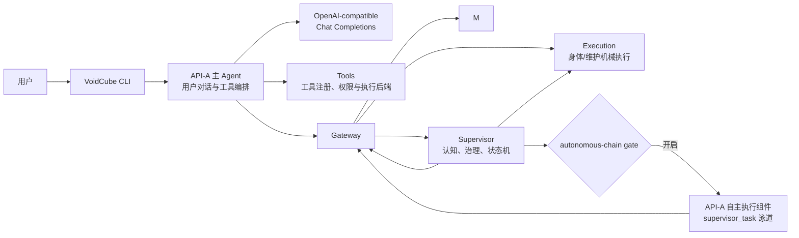
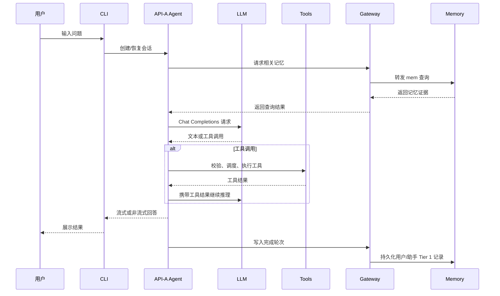
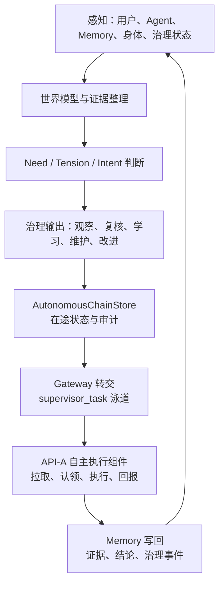
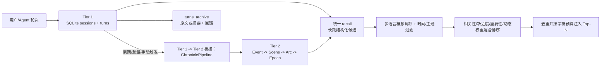
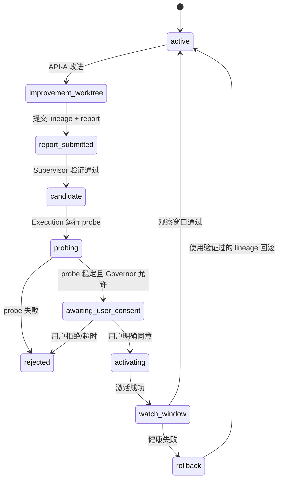

# VoidCube 项目架构与逻辑架构

更新日期：2026-07-23

## 1. 文档定位

本文是 VoidCube 的系统总览，回答四个问题：

- 系统由哪些运行单元组成；
- 用户请求、自主任务和身体治理分别经过哪些链路；
- 每个模块拥有怎样的职责和数据；
- 哪些是当前已经落地的行为，哪些仍是已知限制。

本文描述当前代码，而不是把未来设计当成现行能力。稳定边界以[服务化系统架构基线](./voidcube架构基线.md)为准，目录和文件归属以[项目文件架构](./项目文件架构说明.md)为准，未完成事项以[当前问题](./全链路问题清单.md)为准。

## 2. 一句话架构

VoidCube 是一个以 CLI/Agent 为用户入口、以 Gateway 为本地服务总线、以 Supervisor 为认知与治理中心、以 Memory 为长期状态、以 Execution 为受控副作用出口的本地多服务 Agent 系统。

它不是一个“LLM 直接执行命令”的脚本，而是把“理解与规划”“记忆与证据”“治理与审批”“机械执行”拆成了不同的职责边界。

## 3. 总体逻辑视图



上图中的“API-A/API-B”是职责槽位，不是两个必须独立部署的模型服务：

| 逻辑槽位 | 当前职责 | 典型调用方 |
| --- | --- | --- |
| API-A | 用户交互、工具调用、自主任务执行 | `run_agent.py`、内嵌自主执行组件 |
| API-B | 记忆抽取、压缩、治理判断和长期证据处理 | Memory、Supervisor |

两个槽位可以使用同一供应商或不同模型，但配置、凭据归属、失败状态和调用语义必须分开。

## 4. 运行进程与启动关系

### 4.1 对外入口

打包只暴露 `voidcube` 和 `vc`，两者都进入 `voidcube.py:main`。

```text
voidcube / vc
  -> voidcube.py
    ->（需要时）拉起 Gateway、Memory、Supervisor
    -> VoidCube_cli/main.py
      -> cli.py
        -> run_agent.py / AIAgent
```

`voidcube.py` 还提供 `status`、`stop` 等 daemon 生命周期快捷命令。纯本地命令和单次查询可以跳过 daemon 自动启动。

### 4.2 默认服务

| 服务 | 默认端口 | 实现 | 进程职责 |
| --- | ---: | --- | --- |
| Gateway | 6000 | `systems.gateway.internal_gateway:InternalGateway` | 服务注册、标准路由、活动事实、双泳道和代理 |
| Memory | 6001 | `systems.memory.memory_service:MemoryService` | Tier 1 会话、Tier 2 记忆、压缩和查询 |
| Supervisor | 6002 | `systems.supervisor.supervisor:Supervisor` | 内生驱动、治理在途、身体状态、UI 读模型 |
| Execution | 随 Supervisor | `systems.execution.service:VoidCubeExecutionService` | 作为 Supervisor 进程内挂载的受控执行面 |

启动顺序为：

```text
Gateway -> Memory 注册 -> Supervisor 注册并挂载 Execution -> CLI 进入用户会话
```

Executor 不是第四个独立 daemon。它通过 Gateway 的 executor 路由暴露能力，但实际运行在 Supervisor 进程中。

服务启动前，`VoidCube_cli.ops.serve` 通过 `systems.mem_source_binding` 把 `memai` 固定到仓库共享 `Mem/src`，并验证进程实际导入的 `model_config.py`。该绑定独立于活动 Body，审计位于 `VOIDCUBE_HOME/runtime/memory/mem-source-binding.json`。

### 4.3 生命周期原则

- 基础服务可在自主链路关闭时继续运行；
- Supervisor 启动不代表 autonomous-chain 已开启；
- `/auto` 开启内生驱动、治理复核和当前 CLI 内嵌的自主执行组件；
- `/auto-q` 停止自主链路，不停止用户主 CLI、Gateway、Memory 或 Supervisor；
- 服务注册和后台维护任务由各自服务的 FastAPI lifespan 管理。

## 5. 代码分层与目录所有权

### 5.1 入口与 CLI 层

| 目录/文件 | 所有权 | 不应承担 |
| --- | --- | --- |
| `voidcube.py` | 安装入口、daemon 编排和 CLI 委托 | Agent 推理、业务状态机 |
| `VoidCube_cli/` | 参数、配置、命令、UI、认证和本地生命周期；三个 `chat_*` 模块持有流式展示，`command_router.py` 持有解析/动态路由，`command_execution.py` 持有内建执行表/busy 生命周期 | 长期记忆领域规则 |
| `cli.py` | 交互式会话及 executor/router/Agent 回调协调 | 复制流式展示、动态路由或内建执行分支；新增服务端治理逻辑 |
| `run_agent.py` | `AIAgent` 主循环、请求编排和会话上下文 | 复制已抽离的传输、流式装配、工具调度实现 |

### 5.2 Agent 能力层

`agent/` 是 Agent 的可复用内部能力层：

- `api_request.py`：API-only 消息准备、协议字段隔离、工具消息修复和请求参数规范化；
- `api_response.py`：响应检查、规范化和截断恢复决策；
- `api_attempt.py`：单次模型调用的重试、恢复、重启状态和请求/响应快照；
- `response_disposition.py`：兼容内容、工具调用、文本/空响应 disposition 判定及其 action 应用；
- `chat_transport.py` / `client_lifecycle.py`：请求线程、连接、超时、重连和关闭；
- `conversation_turn.py`：单次用户请求的循环状态、重试计数、终态和退出原因；
- `turn_finalization.py`：单轮持久化、诊断、结果快照、hook、记忆同步和资源清理顺序；
- `error_classifier.py` / `retry_utils.py`：错误分类、重试决策、fallback/transport 执行顺序和可中断等待；
- `stream_response.py`：文本、推理、工具调用、usage 和结束原因装配；
- `context_engine.py` / `context_compressor.py`：上下文预算、压缩和统一 payload/context recovery 执行；
- `tool_schema.py` / `tool_scheduler.py` / `tool_execution.py`：工具 schema、调度、并发、计时和中断补位；
- `tool_turn.py`：成功工具 turn 的内容处理、prefill、执行、pressure/压缩和增量持久化顺序；
- `memory_manager.py` / `memory_provider.py`：Agent 与记忆 Provider 的接入协议；
- `session_persistence.py`：会话消息和增量状态持久化；
- `integration_policy.py`：退役集成拒绝策略。

### 5.3 工具与执行后端层

`tools/` 负责工具注册、schema、权限和执行环境：

```text
tools/registry.py / toolsets.py
  -> terminal / file / web / browser / MCP / delegate
    -> environments/local、docker、ssh、modal、singularity、daytona
```

工具层只提供受控能力，不决定 Supervisor 的治理意图，也不绕过用户同意和身体状态机。

### 5.4 服务化母体层

`systems/` 的职责如下：

| 子目录 | 责任 |
| --- | --- |
| `systems/gateway/` | 服务发现、统一路由、agent proxy、活动记录和双泳道 |
| `systems/memory/` | SQLite Tier 1、Tier 2 bridge、压缩、生命周期和记忆查询 API |
| `systems/supervisor/` | 内生驱动、认知输入、治理判断、任务状态和身体读模型 |
| `systems/execution/` | 维护、probe、身体候选、切换、观察窗口和回滚 |
| `systems/mem_source_binding.py` | canonical `Mem/src` 导入校验、`.pth` 同步和绑定审计；不参与 Body 槽位切换 |
| `systems/body_registry.py` | 身体槽位、活动身体和候选身体的登记模型 |
| `systems/governor.py` | 风险审查和治理裁决模型 |
| `systems/lifecycle.py` | 生命周期操作结果和执行报告 |

### 5.5 MemAI 领域层

`Mem/` 是独立的长期记忆领域包：

- `Event`：有时间锚点的事件；
- `Scene`：相关事件组成的场景；
- `Arc`：跨场景的持续变化或主题；
- `Epoch`：更长时间尺度的阶段性结构；
- Profile/Fact memory：当前有效的稳定事实和画像；
- query、maintenance、governance repository：查询、维护和治理事件。

Memory Service 负责 HTTP、Tier 1、SQLite 和结构化维护调度；MemAI 负责领域对象、抽取、压缩策略和查询语义。Agent 的默认 `mem` Provider 只是经 Gateway 调用 Memory Service 的客户端，不创建本地数据库，也不运行第二套 ChroniclePipeline。

MemAI 作为共享灵魂层始终从 repository canonical `Mem/src` 导入，不从活动 Body worktree 选择版本。Body 升级只改变受治理的 Agent/工具身体，不改变长期记忆领域实现的加载来源。

## 6. 用户请求主链路



请求链路中的关键边界：

1. LLM 只产生文本或结构化工具意图，不直接拥有操作系统权限。
2. 工具调用必须经过 schema、权限、执行环境和错误处理。
3. 流式输出由 `stream_response.py` 装配，传输重连由 `chat_transport.py` 负责。
4. 上下文压缩不能把持久化消息和临时提示混为一体。

## 7. 自主链路

自主链路是 Supervisor 驱动的闭环，不是用户聊天链路的替代模式。



### 7.1 Supervisor 判断阶段

`systems/supervisor/endogenous_drive.py` 和 `planning_runtime.py` 负责：

- 感知快照和世界模型；
- need、intent、signal 和 reflection；
- attention agenda、uncertainty ledger、observation program；
- cognition charter、evidence packet 和 typed proposal；
- 治理输出的风险、证据等级、执行模式和阻塞因素。

Supervisor 负责“是否值得做、以什么风险做、是否需要先观察”，不直接代替 API-A 执行用户任务或代码改造。

### 7.2 任务转交阶段

候选经过程序约束和治理状态机后写入 `AutonomousChainStore`。每次创建、状态、metadata 或优先级变化先把完整任务投影追加到 Mem 治理事件，成功后才发布 Store 快照；Mem 写入失败不得改变 Store。Gateway 提供跨进程路由和泳道，自主执行组件通过 pull/claim 方式接手，不由 Web UI 直接执行。

### 7.3 执行与回写阶段

自主执行组件使用 API-A 和工具层完成任务，结果写回：

- 任务终态和执行证据；
- Memory 的长期事件/结论；
- Supervisor 的下一轮感知和反思输入。

任务必须形成明确的 `planned -> approved -> running -> completed/failed` 主链。身体候选通过 probe 与 Governor 后进入非终态 `awaiting_user_consent`，用户同意且激活成功才完成，用户拒绝则取消。停用自主链路把仍在执行的 `running` 收口为带 `interrupted_by_gate_deactivation` 原因的 `failed`；已有明确等待原因的 `awaiting_user_consent` 保留给用户处理。

## 8. 记忆逻辑架构

### 8.1 两层存储



### 8.2 Tier 1

Tier 1 保存短期、可追溯的会话事实：

- `sessions`：会话元数据和更新时间；
- `turns`：speaker、文本、时间、相关性、`last_decay_at`、标签、去重键；
- `turns_archive`：压缩后的回链、摘要和可选原文。

写入使用参数化 SQL、事务和显式去重键。`owner_id + workspace_id` 是 Session、Turn、归档、Profile、Tier 2、召回追踪和反馈的统一作用域；直接读取、召回、反馈与单条修改都执行同一作用域过滤。创世身份记忆使用显式 `*/*` 全局只读作用域。

### 8.3 Tier 2

Tier 2 通过 ChroniclePipeline 把轮次转换为结构化长期记忆，并维护：

- `compression_level`、`status`、`superseded_by`；
- `importance`、`confidence`、`event_kind`；
- access/citation、pin/hide 等动态权重信号；
- source turns 和 parent/child 回链。

`tier1_to_tier2_bridge.py` 是候选选择、Pipeline 调用、归档回链和 Tier 2 写事务的唯一所有者。批次严格限制在单一 owner/workspace。LLM 不可用时产生的启发式结果默认不进入 Tier 2；没有生成事件，或事件覆盖率、源回链完整度、压缩比、降级比例、原文支持率、标识符忠实度、否定极性一致性未通过阈值时，整批 Tier 1 turn 保持未压缩。每次判断持久化到 `compression_quality_audit`，通过批次的质量记录与归档、Profile/Tier 2 写入同事务提交。

Tier 1 相关性以 `tier1_decay_rate` 作为每个 `decay_interval_hours` 的乘数，根据 `last_decay_at` 到当前参考时间的实际跨度进行指数衰减。同一参考时间重复运行不写数据；旧行在锚点为空时使用 turn 时间作为一次性起点。

### 8.4 动态按需召回

`POST /recall` 是 Agent 自动 prefetch 与 `mem_search` 的唯一召回入口。它不等待 Tier 1 满 30 天后才可用，而是同时处理：

- 未压缩 Tier 1：保留近期、精确、可追溯的原始轮次；
- 活跃 Tier 2：提供 Event/Scene/Arc/Epoch 的长期结构化摘要；
- Profile：提供可纠错、可 supersede 的偏好和事实；
- 归档原文：当摘要遗漏精确细节时回退到 `turns_archive.original_text`；
- 查询计划：对中英文输入归一化，剥离问句和时间提示噪声，生成有限概念词项，并应用类型、主题和时间范围；
- 混合候选：FTS5 trigram 是默认词法索引；可选 `semantic_recall` 使用独立 `/embeddings` 协议，保存 provider/model/dimensions/content hash 并增量失效重建；
- 混合评分：词项覆盖率 + 向量相似度 + 新近度 + Tier 1 relevance 或 Tier 2 importance/dynamic weight；
- 即时回忆：查询含“刚才/刚刚/方才”时只搜索 Tier 1，使用更短新近度衰减，并让近期同义概念优先于较旧的精确词；
- 价值约束：最低分门槛、同一会话最多两条、近重复抑制、Top-N 和完整上下文字符预算；
- 可追溯性：每条结果返回 tier、score、matched terms、评分信号和 source turns。

Agent 每个用户回合只 prefetch 一次，并把服务生成的预算内 `context` 作为临时 `<memory-context>` 注入，不写回会话历史。主模型需要更精确的历史证据时可主动调用 `mem_search`，日期精确回放继续使用 `mem_timeline`。

Memory health 暴露召回请求数、命中数、失败数、命中率、最近结果数和耗时，避免“服务健康”掩盖长期无命中的空转状态。召回结果可通过 `/recall/feedback` 标记 relevant/irrelevant/outdated/incorrect；`Mem/benchmarks/recall_quality.v1.json` 与 `scripts/evaluate_memory_recall.py` 固化 recall@5、MRR 和跨作用域泄漏率基准。

### 8.5 隐私、删除与恢复

Memory Service 在所有持久化入口强制脱敏；Agent 侧还会在写入持久 outbox 前提前脱敏。`POST /forget` 要求明确 `FORGET` 确认，并在一个事务内删除当前作用域的主记录、FTS、embedding、反馈和会话 trace；删除审计只保存目标 hash 与计数。

Memory 使用 SQLite 在线 backup API 创建一致性快照，备份完成后执行 `integrity_check` 并按配置数量轮换。恢复只接受 `runtime/memory/backups/` 内的服务备份，恢复前验证候选并创建回滚快照，恢复失败时自动回滚；显式 JSON 导出写入 `runtime/memory/exports/`。默认 canonical 位置为 `VOIDCUBE_HOME/runtime/memory/`，显式测试或嵌入配置则以数据库同级目录为边界。

## 9. 身体治理逻辑

身体槽位和 Gateway 泳道不是同一个概念：槽位回答“哪份代码在服务”，泳道回答“任务来自用户还是 Supervisor”。



不可绕过的约束：

- 活跃身体不能被改进工作树直接覆盖；
- candidate 必须有可验证的 baseline、commit、changed files 和证据；
- probe 失败不得进入激活；
- Governor 不能代替用户同意；
- 激活或观察窗口失败必须能回滚。

## 10. 关键状态与所有权

| 状态/数据 | 所有者 | 用途 |
| --- | --- | --- |
| Agent 会话、消息、增量游标 | `agent/session_persistence.py` / `VoidCube_core.state` | 用户会话恢复和本地历史 |
| Tier 1/Tier 2 记忆 | Memory Service + MemAI | 长期上下文、证据和回链 |
| 治理在途任务 | `Supervisor` 的 `AutonomousChainStore` + Mem 治理事件 | Store 负责防重复、认领和运行投影；Mem 保存先写入的可恢复审计历史 |
| 内生认知状态 | Supervisor runtime 文件/状态仓 | perception、world model、reflection、策略记忆 |
| 身体注册与活动槽位 | `BodyRegistry` / `Lifecycle` | 身体版本、候选、活动目标和回滚信息 |
| Gateway 服务注册 | Gateway 内存态/服务注册表 | 地址、类型、健康和路由 |
| 日志与追踪 | `VoidCube_core.logging`、Gateway/Supervisor trace | 诊断、健康和运行审计 |

默认运行态统一位于 `VOIDCUBE_HOME`；显式自定义服务路径不会触发仓库根扫描。仓库根目录中出现的 `memory.db`、`mem_governance.jsonl`、`.body-*`、`.soul-runtime/` 只作为一次性迁移源，不是正常读写入口、源码模块或打包内容。

## 11. API 边界

### Gateway

- `/register`、`/health/{service_id}`：服务注册和健康；
- `/api/{path}`：按服务类型和路径代理；
- `/v1/chat/completions`、`/v1/agent/query`：标准 Agent 代理；
- `/v1/sessions/*`：Gateway 会话信息；
- `/admin/*`：服务、路由、活动、身体和场景管理。

Gateway 在重写服务前缀时保留查询参数的顺序、值和重复键；例如 `/api/mem/recall/traces?status=hit&limit=3` 会把同一查询条件转发给 Memory Service。

### Memory

- `/sessions/*`、`/turns/*`：Tier 1 会话和轮次；
- `/recall`：Tier 1 + Tier 2 的统一、预算化动态召回；
- `/recall/feedback`、`/forget`、`/remember`：纠错、硬删除与显式长期记忆；
- `/tier2/compress`、`/compressed/*`：Tier 2 压缩、生命周期、查询和追踪；
- `/semantic/status`、`/semantic/backfill`：可选 embedding 索引状态与回填；
- `/llm/health`、`/mem/usage`：记忆模型健康和使用量；
- `/admin/backups`、`/admin/backups/{backup_id}/restore`：在线备份、列表与验证恢复；
- `/admin/exports`：显式 JSON 导出。

### Supervisor

- `/runtime/*`：活动、轨迹、内生驱动、认知状态和治理事件；
- `/v1/autonomous-chain/*`：任务计划、认领、决策、完成和周期；
- `/body/*`：身体槽位、probe、切换同意和观察窗口；
- `/ui/*`：只读 UI 状态和事件；
- `/health/*`：服务和依赖健康。

### Execution

Execution API 是受控副作用出口，典型接口包括：

- `/executor/memory/compress`；
- `/executor/body/slots/*`；
- `/executor/body/upgrade/execute`；
- `/executor/body/probe/*`；
- `/executor/body/watch-window/*`。

判断服务不能通过内部调用绕过这些执行边界直接修改身体或运行高风险操作。

Execution 的调用边界分为两种，不要求同进程代码为了形式统一而绕一圈 HTTP：

- 外部调用者统一经过 `Gateway -> /api/executor/* -> Execution Service`；
- Supervisor 进程内部统一经过 `VoidCubeExecutionFacade -> Execution Adapter`；
- 两条入口最终必须落到同一组 Adapter，Supervisor 业务逻辑不得直接操作身体文件、运行 probe 或调用底层维护实现。

## 12. 配置与模型调用边界

配置加载主链为：

```text
config.yaml / .env / VOIDCUBE_HOME
  -> VoidCube_cli.config / systems.config
  -> 服务配置模型与 Agent 配置
  -> 具体 API-A/API-B 调用客户端
```

规则如下：

- Provider 配置描述模型、Base URL、凭据和明确调用选项；
- 模型请求统一构建 OpenAI-compatible Chat Completions；
- API-A、Memory、Supervisor 的模型角色分开配置和观测；
- 不能在业务模块中重新实现一套隐式 provider 探测或协议切换；
- 修改模型、鉴权、请求协议或打包表面后，必须运行相关测试、退役集成扫描和 wheel 验收。

## 13. 失败、降级和恢复原则

| 故障 | 当前行为/边界 |
| --- | --- |
| Gateway 不可用 | 服务注册重试并报告 degraded；CLI 可继续进入但 Gateway 相关能力不可用 |
| Memory LLM 不可用 | 记忆压缩显式降级到启发式；摘要路径标记 degraded；不得静默宣称质量等价 |
| Tier 2 无事件 | 保留 Tier 1 turn，不推进压缩标志 |
| 工具调用失败 | Agent 捕获并返回结构化错误，继续或终止由请求状态决定 |
| 自主任务停止 | 写入 interrupted/failed 等明确终态，不能遗留 running |
| 身体 probe/观察失败 | 不激活或回滚到已验证活动身体 |
| 流式连接异常 | 由 transport/response 层执行重连、降级或中断关闭，不能由 UI 拼第二套状态机 |

## 14. 模块协作契约

### 14.1 Agent、Gateway 与 Memory

Agent 保存会话工作状态，但长期事实只有一条主路径：

```text
AIAgent -> mem Provider -> Gateway /api/mem/* -> Memory Service -> MemAI
```

- 预取、显式搜索和时间线查询都携带当前 session ID；
- 完成的用户/助手轮次异步写入 Tier 1，Memory 不可用时返回明确 unavailable，不落本地替代库；
- Tier 1 -> Tier 2 候选、质量门禁、归档和事务由 Memory Service 的 bridge 唯一负责；
- 结构化维护由 Memory Service 生命周期负责，Agent、Execution 和 Supervisor 不运行重复维护循环。

### 14.2 Supervisor、治理历史与 Memory

`AutonomousChainStore` 是在途投影，`GovernanceEventRepository` 是可恢复历史。任务状态变化必须先追加治理事件，成功后才能发布 Store；SelfLearning 结论同样先持久化治理事件，再发布本地结论投影。Governor 观察文件只是派生投影，不能反向成为决策真相或恢复源。

### 14.3 Supervisor 与 Execution

- 跨进程调用：`调用方 -> Gateway -> /api/executor/* -> Execution Service -> Adapter`；
- Supervisor 同进程调用：`Supervisor -> VoidCubeExecutionFacade -> Adapter`；
- Governor review、身体升级、probe、观察窗口和维护动作都从 Facade 进入，业务层不得直接调用 Adapter；
- handoff 异常必须写成可恢复的 retry 或 `failed`，达到最大重试次数后不能停留在 `running`。

### 14.4 Gateway、CLI 与 Tools

- Gateway 持有服务租约、标准前缀映射、健康和 trace 传播；`mem/*`、`supervisor/*` 去除服务前缀，`executor/*` 保留 `/executor/*`；
- Gateway 代理同时转发原始查询参数的多值序列，不能在服务前缀改写时丢失 GET 筛选或分页条件；
- CLI 的用户输入和自主任务分别属于 `user_chat`、`supervisor_task`，展示状态不能改变泳道所有权；
- CLI 所有 Gateway 请求使用服务配置解析出的同一地址；busy 模式为 `interrupt` 时中断当前轮次并重放输入，为 `queue` 时直接排入下一轮，含附件输入必须保持原 payload 和顺序；
- `ToolExecutionCoordinator` 持有调用顺序、并发、计时、异常归一化和工具协议补位，并行结果按模型原始顺序写回；
- 真实超时和取消由终端、浏览器、HTTP、MCP 和远程环境各自实现。Agent 的线程级中断同时覆盖主执行线程与该 Agent 的工具 worker，不能用无法终止后台线程的 Future 超时伪装取消；
- 高风险终端命令由 terminal guard/approval 所有，工具注册表只负责 schema、可用性和分发，不另建第二套审批状态。

### 14.5 运行态所有权

Canonical runtime layout 由 `VoidCube_core/runtime_paths.py` 唯一定义；解析路径本身不得创建目录：

| 状态 | Canonical 路径 | 唯一所有者 | 当前迁移源 |
| --- | --- | --- | --- |
| 会话与消息 | `VOIDCUBE_HOME/state.db` | `VoidCube_core.state.SessionDB`；Agent 通过 `SessionPersistence` 使用 | 已在 canonical，无迁移 |
| Memory Tier 1/2 SQLite | `VOIDCUBE_HOME/runtime/memory/memory.db` | Memory Service 配置与持久化层 | `<repo>/memory.db` |
| MemAI 源绑定审计 | `VOIDCUBE_HOME/runtime/memory/mem-source-binding.json` | `systems.mem_source_binding` / `VoidCube_cli.ops.serve` | 无；始终重建并验证 canonical `Mem/src` |
| Supervisor Store、认知状态和治理事件 | `VOIDCUBE_HOME/runtime/supervisor/` | Supervisor runtime assembler 装配的 Store/Repository | `<repo>/.soul-runtime/` |
| Body registry、active pointer 和 slots | `VOIDCUBE_HOME/runtime/body/{registry.json,active.json,slots/}` | `BodyRegistryManager`；源码仓仅作为 materialization source | `<repo>/.body-*` |
| 治理事件日志 | `VOIDCUBE_HOME/runtime/supervisor/mem_governance.jsonl` | `GovernanceEventRepository`；Bridge、Execution 和 SelfLearning 只能使用注入的 Repository | `<repo>/mem_governance.jsonl` 及旧 SelfLearning 旁路日志 |

配置来源分成两个明确边界：

| 配置域 | 真相与优先级 | 不允许 |
| --- | --- | --- |
| CLI/Agent 产品配置 | 显式 CLI 参数 > `VOIDCUBE_HOME/config.yaml` 规范化配置 >代码默认；凭据由用户 `.env`/credential pool 解析，项目 `.env` 仅开发回退 | 重新引入根级 model schema、第二个内存配置对象或未声明环境变量覆盖 |
| 本地服务启动配置 | `systems.config` 的显式环境变量 > typed default；由 `VoidCube_cli.ops.serve` 向具体服务配置复制 | 服务模块各自维护不同默认路径，或暗中再读取项目 `config.yaml` |

旧路径只允许一次性迁移器读取。正常运行不得双读、双写，也不得在迁移完成后保留兼容分支。真实旧数据只在对应服务以 canonical 默认配置启动时迁移，不由开发工具手工搬运。

## 15. 当前最值得优先处理的架构缺口

以下不是“系统不存在”，而是已存在主链路上的具体工程缺口：

1. 如果服务要支持多用户，增加认证、租户所有权字段和每个查询/写入接口的隔离检查。
2. 旧治理事件可能缺少标题和摘要；只在真实数据确实影响观察时做离线补全，不在运行时猜测。

## 16. 文档与代码维护规则

- 改变模块职责时，同一阶段更新本文、基线文档和聚焦测试；
- 新主路径替代旧路径后，删除失效参数、兼容分支、旧提示和冗余测试；
- `candidate/task` 是自主治理的输出投影时，应明确标注为投影，不能反过来定义认知核心；
- 文档只记录当前行为和未完成问题，不把完成日志或历史迁移过程写回主架构；
- 任何新增模型、鉴权、技能或打包入口都必须遵守退役集成零入口约束。

## 17. 相关文档

- [服务化系统架构基线](./voidcube架构基线.md)
- [项目文件架构](./项目文件架构说明.md)
- [内生驱动核心设计](./内生驱动核心设计.md)
- [CLI 展示与 Gateway 双泳道](./CLI展示与gateway双槽设计.md)
- [API 配置与模型调用点](./API配置双槽与模型调用点.md)
- [开发与验证](./开发与验证.md)
- [当前问题](./全链路问题清单.md)
