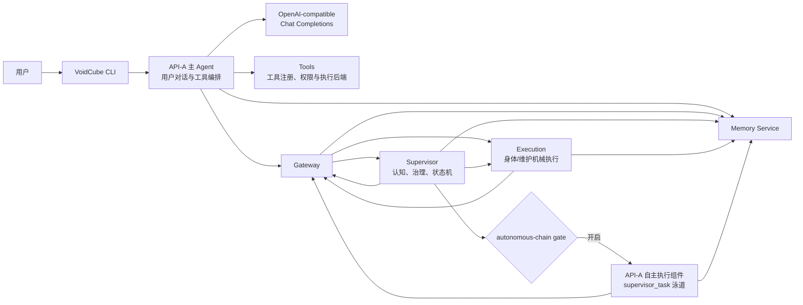
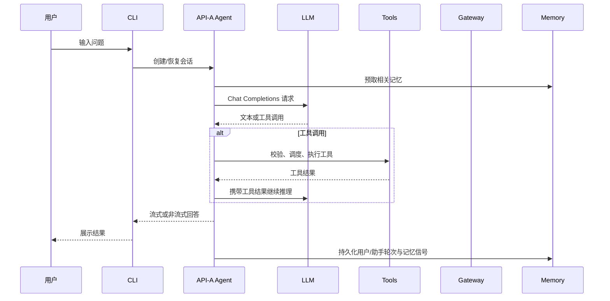
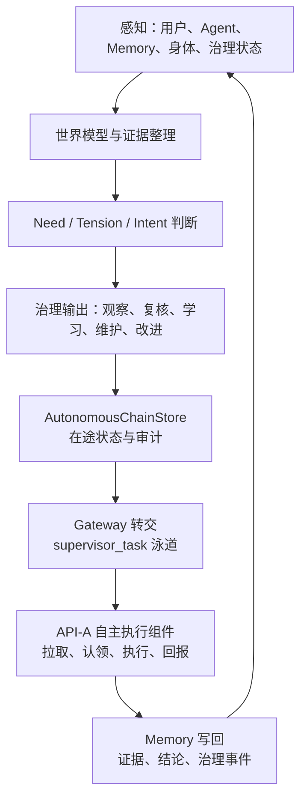
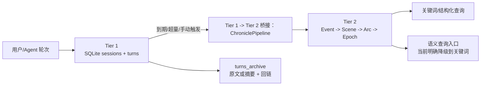
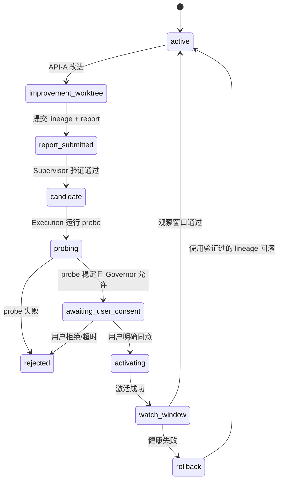

# VoidCube 项目架构与逻辑架构

更新日期：2026-07-21

## 1. 文档定位

本文是 VoidCube 的系统总览，回答四个问题：

- 系统由哪些运行单元组成；
- 用户请求、自主任务和身体治理分别经过哪些链路；
- 每个模块拥有怎样的职责和数据；
- 哪些是当前已经落地的行为，哪些仍是已知限制。

本文描述当前代码，而不是把未来设计当成现行能力。稳定边界以[服务化系统架构基线](./voidcube架构基线.md)为准，目录和文件归属以[项目文件架构](./项目文件架构说明.md)为准，未完成事项以[当前问题](./全链路问题清单.md)为准。

## 2. 一句话架构

VoidCube 是一个以 CLI/Agent 为用户入口、以 Gateway 为本地服务总线、以 Supervisor 为认知与治理中心、以 Memory 为长期状态、以 Execution 为受控副作用出口的本地多服务 Agent 系统。

它不是一个“LLM 直接执行命令”的脚本，而是把“理解与规划”“记忆与证据”“治理与审批”“机械执行”拆成了不同的职责边界。

## 3. 总体逻辑视图



上图中的“API-A/API-B”是职责槽位，不是两个必须独立部署的模型服务：

| 逻辑槽位 | 当前职责 | 典型调用方 |
| --- | --- | --- |
| API-A | 用户交互、工具调用、自主任务执行 | `run_agent.py`、内嵌自主执行组件 |
| API-B | 记忆抽取、压缩、治理判断和长期证据处理 | Memory、Supervisor |

两个槽位可以使用同一供应商或不同模型，但配置、凭据归属、失败状态和调用语义必须分开。

## 4. 运行进程与启动关系

### 4.1 对外入口

打包只暴露 `voidcube` 和 `vc`，两者都进入 `voidcube.py:main`。

```text
voidcube / vc
  -> voidcube.py
    ->（需要时）拉起 Gateway、Memory、Supervisor
    -> VoidCube_cli/main.py
      -> cli.py
        -> run_agent.py / AIAgent
```

`voidcube.py` 还提供 `status`、`stop` 等 daemon 生命周期快捷命令。纯本地命令和单次查询可以跳过 daemon 自动启动。

### 4.2 默认服务

| 服务 | 默认端口 | 实现 | 进程职责 |
| --- | ---: | --- | --- |
| Gateway | 6000 | `systems.gateway.internal_gateway:InternalGateway` | 服务注册、标准路由、活动事实、双泳道和代理 |
| Memory | 6001 | `systems.memory.memory_service:MemoryService` | Tier 1 会话、Tier 2 记忆、压缩和查询 |
| Supervisor | 6002 | `systems.supervisor.supervisor:Supervisor` | 内生驱动、治理在途、身体状态、UI 读模型 |
| Execution | 随 Supervisor | `systems.execution.service:VoidCubeExecutionService` | 作为 Supervisor 进程内挂载的受控执行面 |

启动顺序为：

```text
Gateway -> Memory 注册 -> Supervisor 注册并挂载 Execution -> CLI 进入用户会话
```

Executor 不是第四个独立 daemon。它通过 Gateway 的 executor 路由暴露能力，但实际运行在 Supervisor 进程中。

### 4.3 生命周期原则

- 基础服务可在自主链路关闭时继续运行；
- Supervisor 启动不代表 autonomous-chain 已开启；
- `/auto` 开启内生驱动、治理复核和当前 CLI 内嵌的自主执行组件；
- `/auto-q` 停止自主链路，不停止用户主 CLI、Gateway、Memory 或 Supervisor；
- 服务注册和后台维护任务由各自服务的 FastAPI lifespan 管理。

## 5. 代码分层与目录所有权

### 5.1 入口与 CLI 层

| 目录/文件 | 所有权 | 不应承担 |
| --- | --- | --- |
| `voidcube.py` | 安装入口、daemon 编排和 CLI 委托 | Agent 推理、业务状态机 |
| `VoidCube_cli/` | 参数、配置、命令、UI、认证和本地生命周期；三个 `chat_*` 模块持有流式展示，`command_router.py` 持有解析/动态路由，`command_execution.py` 持有内建执行表/busy 生命周期 | 长期记忆领域规则 |
| `cli.py` | 交互式会话及 executor/router/Agent 回调协调 | 复制流式展示、动态路由或内建执行分支；新增服务端治理逻辑 |
| `run_agent.py` | `AIAgent` 主循环、请求编排和会话上下文 | 复制已抽离的传输、流式装配、工具调度实现 |

### 5.2 Agent 能力层

`agent/` 是 Agent 的可复用内部能力层：

- `api_request.py`：API-only 消息准备、协议字段隔离、工具消息修复和请求参数规范化；
- `api_response.py`：响应检查、规范化和截断恢复决策；
- `api_attempt.py`：单次模型调用的重试、恢复、重启状态和请求/响应快照；
- `response_disposition.py`：兼容内容、工具调用、文本/空响应 disposition 判定及其 action 应用；
- `chat_transport.py` / `client_lifecycle.py`：请求线程、连接、超时、重连和关闭；
- `conversation_turn.py`：单次用户请求的循环状态、重试计数、终态和退出原因；
- `turn_finalization.py`：单轮持久化、诊断、结果快照、hook、记忆同步和资源清理顺序；
- `error_classifier.py` / `retry_utils.py`：错误分类、重试决策、fallback/transport 执行顺序和可中断等待；
- `stream_response.py`：文本、推理、工具调用、usage 和结束原因装配；
- `context_engine.py` / `context_compressor.py`：上下文预算、压缩和统一 payload/context recovery 执行；
- `tool_schema.py` / `tool_scheduler.py` / `tool_execution.py`：工具 schema、调度、并发、计时和中断补位；
- `tool_turn.py`：成功工具 turn 的内容处理、prefill、执行、pressure/压缩和增量持久化顺序；
- `memory_manager.py` / `memory_provider.py`：Agent 与记忆 Provider 的接入协议；
- `session_persistence.py`：会话消息和增量状态持久化；
- `integration_policy.py`：退役集成拒绝策略。

### 5.3 工具与执行后端层

`tools/` 负责工具注册、schema、权限和执行环境：

```text
tools/registry.py / toolsets.py
  -> terminal / file / web / browser / MCP / delegate
    -> environments/local、docker、ssh、modal、singularity、daytona
```

工具层只提供受控能力，不决定 Supervisor 的治理意图，也不绕过用户同意和身体状态机。

### 5.4 服务化母体层

`systems/` 的职责如下：

| 子目录 | 责任 |
| --- | --- |
| `systems/gateway/` | 服务发现、统一路由、agent proxy、活动记录和双泳道 |
| `systems/memory/` | SQLite Tier 1、Tier 2 bridge、压缩、生命周期和记忆查询 API |
| `systems/supervisor/` | 内生驱动、认知输入、治理判断、任务状态和身体读模型 |
| `systems/execution/` | 维护、probe、身体候选、切换、观察窗口和回滚 |
| `systems/body_registry.py` | 身体槽位、活动身体和候选身体的登记模型 |
| `systems/governor.py` | 风险审查和治理裁决模型 |
| `systems/lifecycle.py` | 生命周期操作结果和执行报告 |

### 5.5 MemAI 领域层

`Mem/` 是独立的长期记忆领域包：

- `Event`：有时间锚点的事件；
- `Scene`：相关事件组成的场景；
- `Arc`：跨场景的持续变化或主题；
- `Epoch`：更长时间尺度的阶段性结构；
- Profile/Fact memory：当前有效的稳定事实和画像；
- query、maintenance、governance repository：查询、维护和治理事件。

Memory Service 负责 HTTP、Tier 1 和 SQLite；MemAI 负责领域对象、抽取、压缩策略和查询语义。两者不能各自维护另一套长期记忆主路径。

## 6. 用户请求主链路



请求链路中的关键边界：

1. LLM 只产生文本或结构化工具意图，不直接拥有操作系统权限。
2. 工具调用必须经过 schema、权限、执行环境和错误处理。
3. 流式输出由 `stream_response.py` 装配，传输重连由 `chat_transport.py` 负责。
4. 上下文压缩不能把持久化消息和临时提示混为一体。

## 7. 自主链路

自主链路是 Supervisor 驱动的闭环，不是用户聊天链路的替代模式。



### 7.1 Supervisor 判断阶段

`systems/supervisor/endogenous_drive.py` 和 `planning_runtime.py` 负责：

- 感知快照和世界模型；
- need、intent、signal 和 reflection；
- attention agenda、uncertainty ledger、observation program；
- cognition charter、evidence packet 和 typed proposal；
- 治理输出的风险、证据等级、执行模式和阻塞因素。

Supervisor 负责“是否值得做、以什么风险做、是否需要先观察”，不直接代替 API-A 执行用户任务或代码改造。

### 7.2 任务转交阶段

候选经过程序约束和治理状态机后写入 `AutonomousChainStore`。每次创建、状态、metadata 或优先级变化先把完整任务投影追加到 Mem 治理事件，成功后才发布 Store 快照；Mem 写入失败不得改变 Store。Gateway 提供跨进程路由和泳道，自主执行组件通过 pull/claim 方式接手，不由 Web UI 直接执行。

### 7.3 执行与回写阶段

自主执行组件使用 API-A 和工具层完成任务，结果写回：

- 任务终态和执行证据；
- Memory 的长期事件/结论；
- Supervisor 的下一轮感知和反思输入。

任务必须形成明确的 `planned -> approved -> running -> completed/failed` 主链。身体候选通过 probe 与 Governor 后进入非终态 `awaiting_user_consent`，用户同意且激活成功才完成，用户拒绝则取消。停用自主链路把仍在执行的 `running` 收口为带 `interrupted_by_gate_deactivation` 原因的 `failed`；已有明确等待原因的 `awaiting_user_consent` 保留给用户处理。

## 8. 记忆逻辑架构

### 8.1 两层存储



### 8.2 Tier 1

Tier 1 保存短期、可追溯的会话事实：

- `sessions`：会话元数据和更新时间；
- `turns`：speaker、文本、时间、相关性、`last_decay_at`、标签、去重键；
- `turns_archive`：压缩后的回链、摘要和可选原文。

写入使用参数化 SQL、事务和显式去重键。会话 ID 能够隔离会话查询，但当前服务层没有完整的租户所有权/鉴权模型；是否支持多用户部署需要额外边界。

### 8.3 Tier 2

Tier 2 通过 ChroniclePipeline 把轮次转换为结构化长期记忆，并维护：

- `compression_level`、`status`、`superseded_by`；
- `importance`、`confidence`、`event_kind`；
- access/citation、pin/hide 等动态权重信号；
- source turns 和 parent/child 回链。

`tier1_to_tier2_bridge.py` 是候选选择、Pipeline 调用、归档回链和 Tier 2 写事务的唯一所有者。LLM 不可用时，桥接使用启发式抽取并报告降级比例；没有生成事件，或事件覆盖率、源回链完整度、压缩比、降级比例未通过配置阈值时，整批 Tier 1 turn 保持未压缩。每次质量判断持久化到 `compression_quality_audit`，通过批次的质量记录与归档、Tier 2 写入同事务提交。

Tier 1 相关性以 `tier1_decay_rate` 作为每个 `decay_interval_hours` 的乘数，根据 `last_decay_at` 到当前参考时间的实际跨度进行指数衰减。同一参考时间重复运行不写数据；旧行在锚点为空时使用 turn 时间作为一次性起点。

### 8.4 恢复与当前限制

Memory 使用 SQLite 在线 backup API 创建一致性快照，备份完成后执行 `integrity_check` 并按配置数量轮换。恢复只接受 `runtime/memory/backups/` 内的服务备份，恢复前验证候选并创建回滚快照，恢复失败时自动回滚；显式 JSON 导出写入 `runtime/memory/exports/`。默认 canonical 位置为 `VOIDCUBE_HOME/runtime/memory/`，显式测试或嵌入配置则以数据库同级目录为边界。

当前仍需明确的限制：

- `/memories` 的旧摘要 fallback 是前 500 字截断，并标记 `summary_degraded`；
- 当前没有正式 embedding 协议或向量列，`/compressed/semantic-search` 明确返回关键词降级及原因；
- 服务定位为本地单用户运行，管理与查询接口不提供多租户隔离。

## 9. 身体治理逻辑

身体槽位和 Gateway 泳道不是同一个概念：槽位回答“哪份代码在服务”，泳道回答“任务来自用户还是 Supervisor”。



不可绕过的约束：

- 活跃身体不能被改进工作树直接覆盖；
- candidate 必须有可验证的 baseline、commit、changed files 和证据；
- probe 失败不得进入激活；
- Governor 不能代替用户同意；
- 激活或观察窗口失败必须能回滚。

## 10. 关键状态与所有权

| 状态/数据 | 所有者 | 用途 |
| --- | --- | --- |
| Agent 会话、消息、增量游标 | `agent/session_persistence.py` / `VoidCube_core.state` | 用户会话恢复和本地历史 |
| Tier 1/Tier 2 记忆 | Memory Service + MemAI | 长期上下文、证据和回链 |
| 治理在途任务 | `Supervisor` 的 `AutonomousChainStore` + Mem 治理事件 | Store 负责防重复、认领和运行投影；Mem 保存先写入的可恢复审计历史 |
| 内生认知状态 | Supervisor runtime 文件/状态仓 | perception、world model、reflection、策略记忆 |
| 身体注册与活动槽位 | `BodyRegistry` / `Lifecycle` | 身体版本、候选、活动目标和回滚信息 |
| Gateway 服务注册 | Gateway 内存态/服务注册表 | 地址、类型、健康和路由 |
| 日志与追踪 | `VoidCube_core.logging`、Gateway/Supervisor trace | 诊断、健康和运行审计 |

默认运行态统一位于 `VOIDCUBE_HOME`；显式自定义服务路径不会触发仓库根扫描。仓库根目录中出现的 `memory.db`、`mem_governance.jsonl`、`.body-*`、`.soul-runtime/` 只作为一次性迁移源，不是正常读写入口、源码模块或打包内容。

## 11. API 边界

### Gateway

- `/register`、`/health/{service_id}`：服务注册和健康；
- `/api/{path}`：按服务类型和路径代理；
- `/v1/chat/completions`、`/v1/agent/query`：标准 Agent 代理；
- `/v1/sessions/*`：Gateway 会话信息；
- `/admin/*`：服务、路由、活动、身体和场景管理。

### Memory

- `/sessions/*`、`/turns/*`：Tier 1 会话和轮次；
- `/tier2/compress`、`/compressed/*`：Tier 2 压缩、生命周期、查询和追踪；
- `/memories/*`：旧的 namespace memory API；
- `/llm/health`、`/mem/usage`：记忆模型健康和使用量。
- `/admin/backups`、`/admin/backups/{backup_id}/restore`：在线备份、列表与验证恢复；
- `/admin/exports`：显式 JSON 导出。

### Supervisor

- `/runtime/*`：活动、轨迹、内生驱动、认知状态和治理事件；
- `/v1/autonomous-chain/*`：任务计划、认领、决策、完成和周期；
- `/body/*`：身体槽位、probe、切换同意和观察窗口；
- `/ui/*`：只读 UI 状态和事件；
- `/health/*`：服务和依赖健康。

### Execution

Execution API 是受控副作用出口，典型接口包括：

- `/executor/memory/compress`；
- `/executor/body/slots/*`；
- `/executor/body/upgrade/execute`；
- `/executor/body/probe/*`；
- `/executor/body/watch-window/*`。

判断服务不能通过内部调用绕过这些执行边界直接修改身体或运行高风险操作。

Execution 的调用边界分为两种，不要求同进程代码为了形式统一而绕一圈 HTTP：

- 外部调用者统一经过 `Gateway -> /api/executor/* -> Execution Service`；
- Supervisor 进程内部统一经过 `VoidCubeExecutionFacade -> Execution Adapter`；
- 两条入口最终必须落到同一组 Adapter，Supervisor 业务逻辑不得直接操作身体文件、运行 probe 或调用底层维护实现。

## 12. 配置与模型调用边界

配置加载主链为：

```text
config.yaml / .env / VOIDCUBE_HOME
  -> VoidCube_cli.config / systems.config
  -> 服务配置模型与 Agent 配置
  -> 具体 API-A/API-B 调用客户端
```

规则如下：

- Provider 配置描述模型、Base URL、凭据和明确调用选项；
- 模型请求统一构建 OpenAI-compatible Chat Completions；
- API-A、Memory、Supervisor 的模型角色分开配置和观测；
- 不能在业务模块中重新实现一套隐式 provider 探测或协议切换；
- 修改模型、鉴权、请求协议或打包表面后，必须运行相关测试、退役集成扫描和 wheel 验收。

## 13. 失败、降级和恢复原则

| 故障 | 当前行为/边界 |
| --- | --- |
| Gateway 不可用 | 服务注册重试并报告 degraded；CLI 可继续进入但 Gateway 相关能力不可用 |
| Memory LLM 不可用 | 记忆压缩显式降级到启发式；摘要路径标记 degraded；不得静默宣称质量等价 |
| Tier 2 无事件 | 保留 Tier 1 turn，不推进压缩标志 |
| 工具调用失败 | Agent 捕获并返回结构化错误，继续或终止由请求状态决定 |
| 自主任务停止 | 写入 interrupted/failed 等明确终态，不能遗留 running |
| 身体 probe/观察失败 | 不激活或回滚到已验证活动身体 |
| 流式连接异常 | 由 transport/response 层执行重连、降级或中断关闭，不能由 UI 拼第二套状态机 |

## 14. 主干架构收敛计划

### 14.1 主干的定义

当前阶段的“主干”只包含以下六条必须稳定的契约：

| 主干契约 | 唯一主路径 | 真相所有者 |
| --- | --- | --- |
| 启动与服务发现 | `voidcube.py -> Gateway -> Memory -> Supervisor` | `voidcube.py` 与各服务 lifespan |
| 用户请求 | `CLI -> AIAgent -> ChatTransport -> LLM/Tools -> SessionPersistence` | `AIAgent` 负责编排，抽离模块负责各自机制 |
| 外部服务调用 | 调用者 `-> Gateway -> 目标服务` | Gateway 注册表和标准路由 |
| 同进程执行 | Supervisor `-> VoidCubeExecutionFacade -> Adapter` | Execution Facade 与 Adapter |
| 长期事实 | Agent/自主执行 `-> Memory Service -> MemAI` | Memory/MemAI；Agent 会话只是可恢复工作状态 |
| 自主治理 | Supervisor 判断 `-> AutonomousChainStore -> API-A 执行 -> Mem 回写` | 在途状态归 Store，长期历史归 Mem 治理事件 |

只有这些契约完成所有权收口、失败语义和契约测试后，才进入模块间配合优化。文件拆分、算法调优或 UI 改版不能替代主干闭环。

### 14.2 已确定的架构决策

1. `Gateway` 是跨进程的标准入口，不是同进程对象调用必须经过的网络跳板。
2. `VoidCubeExecutionFacade` 是 Supervisor 内部唯一执行边界；业务判断层不得直接调用底层 Adapter 或修改运行态。
3. Agent 可以保存会话、消息游标和临时上下文，但不拥有长期身份、治理裁决或跨会话事实真相。
4. `AutonomousChainStore` 保存待判断、待认领、执行中和终态投影；Mem 治理事件保存可恢复历史。任务变化按 Mem 事件先写、Store 快照后发布；启动按事件时间校正丢失或落后的 Store。管理清空追加全局截止事件，恢复只重放截止点之后的任务，不物理删除治理历史。
5. 当前模型协议只允许 OpenAI-compatible Chat Completions，因此由通用 LLM 输出浮点数组的伪 embedding 不属于主干能力。先移除伪语义成功路径；真正语义检索必须在独立协议决策明确模型、版本、写入、回填和失效策略后再进入主干。
6. 单用户本地运行是当前部署边界；多租户只作为条件性扩展，不提前让 metadata 承担安全职责。

### 14.3 分阶段顺序

| 阶段 | 目标 | 必须完成 | 阶段验收门 |
| --- | --- | --- | --- |
| M0 架构契约冻结 | 消除主干定义冲突 | 固定上述六条契约；统一 Agent 状态表述、Gateway/Facade 边界、长期真相和语义检索决策 | 主线文档无冲突；文档契约测试锁定关键所有权；不改业务行为 |
| M1 用户链路收口 | 先保证直接服务用户的链路可维护 | Agent 侧请求/响应、传输、状态、恢复、disposition、工具 turn 与 finalization 各有唯一所有者；CLI 流式展示归三个 `chat_*` 模块，动态路由归 `command_router.py`，内建执行与 busy 生命周期归 `command_execution.py`；同轮删除原实现 | 流式/非流式、工具调用、上下文恢复、模型切换、持久化、中断和命令契约测试全部通过；主 CLI 行为不变 |
| M2 状态与配置归一 | 为恢复、备份和多进程一致性建立前提 | 运行态迁入 `VOIDCUBE_HOME`；明确配置加载优先级；固定 Store、Mem 治理日志、身体注册和会话状态的所有者 | 新安装不在仓库根目录写运行数据；一次性迁移可验证且完成后无旧路径读取/双写 |
| M3 Memory 主链闭环 | 保证长期事实正确且可恢复 | 移除伪语义路径；统一 Tier 1 -> Tier 2 bridge；实现时间衰减、质量门禁、备份恢复；保持无事件不归档 | 重复执行、重启、降级、回滚、备份恢复和数据回链测试通过；不存在第二套 bridge 主实现 |
| M4 治理与执行闭环 | 固定“判断、转交、执行、回写”责任 | 收口 Store/Mem 恢复规则；固化任务状态机；确保外部 Gateway 与内部 Facade 落到同一 Adapter；保持用户同意门 | 自主任务无悬空 `running`；重复转交幂等；身体流程不能绕过 probe、Governor 或用户同意；端到端测试通过 |
| M5 发布与运行验收 | 证明整个主干可安装、可观测、可恢复 | 统一健康/降级/trace 语义；三服务启动与注册恢复测试；隔离安装和 wheel 内容验收 | 主仓测试、Mem 测试、退役集成扫描、wheel 检查和隔离安装全部通过 |

阶段必须按 `M0 -> M1 -> M2 -> M3 -> M4 -> M5` 推进。可以在同一阶段内并行补测试或文档，但不得用后续模块联调掩盖前一阶段未确定的所有权。

当前状态：M0、M1、M2、M3、M4、M5 已完成。M5 已通过真实三服务启动、Memory/Supervisor/Executor 注册恢复、Memory shutdown 取消、不可用降级、Gateway trace、主仓、Mem、退役扫描、wheel 内容校验、editable 隔离安装和 wheel 隔离安装验收。主干收敛完成，当前按真实调用边进入模块配合探索。

### 14.4 M2 状态与配置归一契约

Canonical runtime layout 由 `VoidCube_core/runtime_paths.py` 唯一定义；解析路径本身不得创建目录：

| 状态 | Canonical 路径 | 唯一所有者 | 当前迁移源 |
| --- | --- | --- | --- |
| 会话与消息 | `VOIDCUBE_HOME/state.db` | `VoidCube_core.state.SessionDB`；Agent 通过 `SessionPersistence` 使用 | 已在 canonical，无迁移 |
| Memory Tier 1/2 SQLite | `VOIDCUBE_HOME/runtime/memory/memory.db` | Memory Service 配置与持久化层 | `<repo>/memory.db` |
| Supervisor Store、认知状态和治理事件 | `VOIDCUBE_HOME/runtime/supervisor/` | Supervisor runtime assembler 装配的 Store/Repository | `<repo>/.soul-runtime/` |
| Body registry、active pointer 和 slots | `VOIDCUBE_HOME/runtime/body/{registry.json,active.json,slots/}` | `BodyRegistryManager`；源码仓仅作为 materialization source | `<repo>/.body-*` |
| 治理事件日志 | `VOIDCUBE_HOME/runtime/supervisor/mem_governance.jsonl` | `GovernanceEventRepository`；Bridge、Execution 和 SelfLearning 只能使用注入的 Repository | `<repo>/mem_governance.jsonl` 及旧 SelfLearning 旁路日志 |

配置来源分成两个明确边界，不再用空壳“统一配置”掩盖差异：

| 配置域 | 真相与优先级 | 不允许 |
| --- | --- | --- |
| CLI/Agent 产品配置 | 显式 CLI 参数 > `VOIDCUBE_HOME/config.yaml` 规范化配置 >代码默认；凭据由用户 `.env`/credential pool 解析，项目 `.env` 仅开发回退 | 重新引入根级 model schema、第二个内存配置对象或未声明环境变量覆盖 |
| 本地服务启动配置 | `systems.config` 的显式环境变量 > typed default；由 `VoidCube_cli.ops.serve` 向具体服务配置复制 | 服务模块各自维护不同默认路径，或暗中再读取项目 `config.yaml` |

M2 迁移必须按以下顺序执行：

1. 固定 canonical/legacy 路径对象和无副作用测试；删除未引用的 `unified_config.py` 空壳。
2. 统一 Memory Service 配置类型；用 SQLite backup/integrity check 迁移数据库及 sidecar，验证后切 canonical 唯一入口并删除旧源。
3. 将 Supervisor runtime root 切到 canonical；逐文件校验 Store、治理事件和认知状态后删除 `.soul-runtime` 旧源。
4. 为 `BodyRegistryManager` 分离 source repo 与 state root；迁移 registry、pointer、slots 后重写内部绝对路径并执行 probe/rollback 测试。
5. 归并根级 `mem_governance.jsonl`，确保只有 Repository 写入；删除所有项目根 fallback。
6. 锁定配置优先级、全仓 legacy-path 零读取、新安装仓库根零运行态和一次性迁移幂等测试。

迁移期间允许显式迁移器读取旧源；正常运行路径不得同时读取新旧位置，不得双写，也不得在迁移完成后保留兼容分支。

截至当前提交，第 1 至 6 步已全部完成。Memory 通过 SQLite backup 与 `integrity_check` 发布；Supervisor 通过文件集合、SHA-256、JSON/JSONL 校验后原子发布；Body 重写 slots 绝对路径并修复 Git linked-worktree 管理记录；治理事件按 ID 校验、去重、按时间排序并合并 primary/retry 日志，同 ID 内容冲突时拒绝发布。Bridge、Execution 和 SelfLearning 不再创建隐式 Repository 路径，Mem pipeline 的旧 soul 默认入口已删除。迁移、损坏数据、冲突、幂等、显式路径隔离、probe/rollback、连续重启与新安装仓库根零运行态均有直接测试。真实旧数据不由开发工具手工搬运，只在对应服务下次以 canonical 默认配置启动时执行一次性迁移。

### 14.5 模块配合探索的进入条件

完成 M5 后，再按真实调用边逐组探索模块配合：

1. Agent 与 Memory：预取、写回、上下文注入和会话边界；
2. Supervisor 与 Memory：证据读取、治理事件、压缩质量和恢复；
3. Supervisor 与 Execution：执行请求、幂等、回滚和用户同意；
4. Gateway 与各服务：注册租约、路由、健康和 trace 传播；
5. CLI 与自主链路：双泳道展示、中断和用户输入优先级；
6. Tools 与执行环境：权限、并发、超时和结果规范化。

每组探索都必须以主干契约为约束，只能发现并修复配合问题，不能重新发明第二套入口、状态仓或兼容协议。

## 15. 当前最值得优先处理的架构缺口

以下不是“系统不存在”，而是已存在主链路上的具体工程缺口：

1. 如果服务要支持多用户，增加认证、租户所有权字段和每个查询/写入接口的隔离检查。
2. 为 Gateway 注册、服务 lifespan、自主任务终态和身体切换补齐跨服务集成测试，并完成 M5 构建与隔离安装验收。

## 16. 文档与代码维护规则

- 改变模块职责时，同一阶段更新本文、基线文档和聚焦测试；
- 新主路径替代旧路径后，删除失效参数、兼容分支、旧提示和冗余测试；
- `candidate/task` 是自主治理的输出投影时，应明确标注为投影，不能反过来定义认知核心；
- 文档只记录当前行为和未完成问题，不把完成日志或历史迁移过程写回主架构；
- 任何新增模型、鉴权、技能或打包入口都必须遵守退役集成零入口约束。

## 17. 相关文档

- [服务化系统架构基线](./voidcube架构基线.md)
- [项目文件架构](./项目文件架构说明.md)
- [内生驱动核心设计](./内生驱动核心设计.md)
- [CLI 展示与 Gateway 双泳道](./CLI展示与gateway双槽设计.md)
- [API 配置与模型调用点](./API配置双槽与模型调用点.md)
- [开发与验证](./开发与验证.md)
- [当前问题](./全链路问题清单.md)
