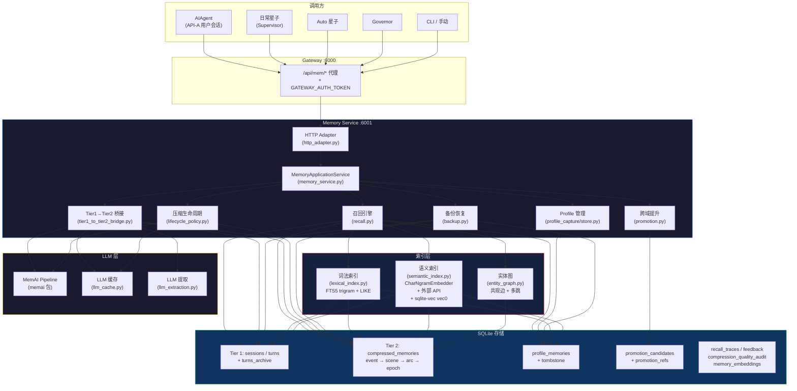
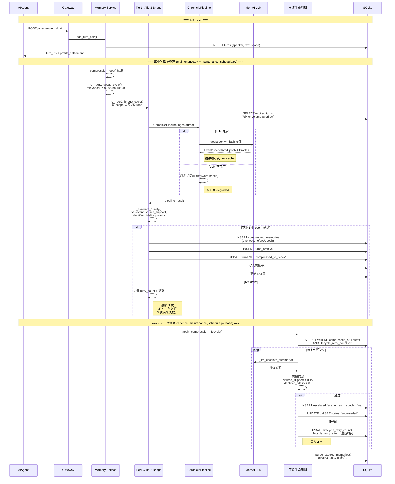
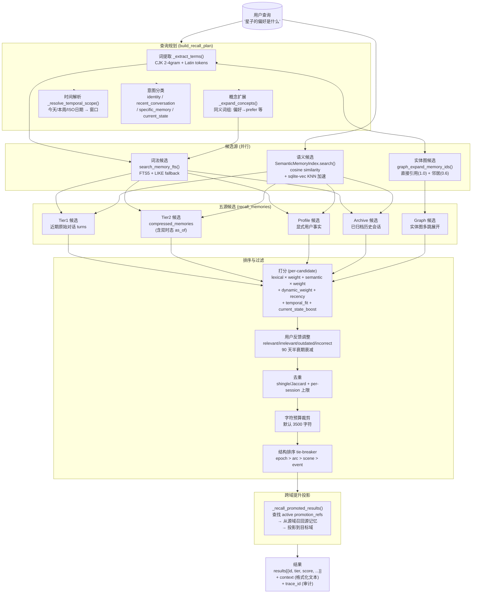
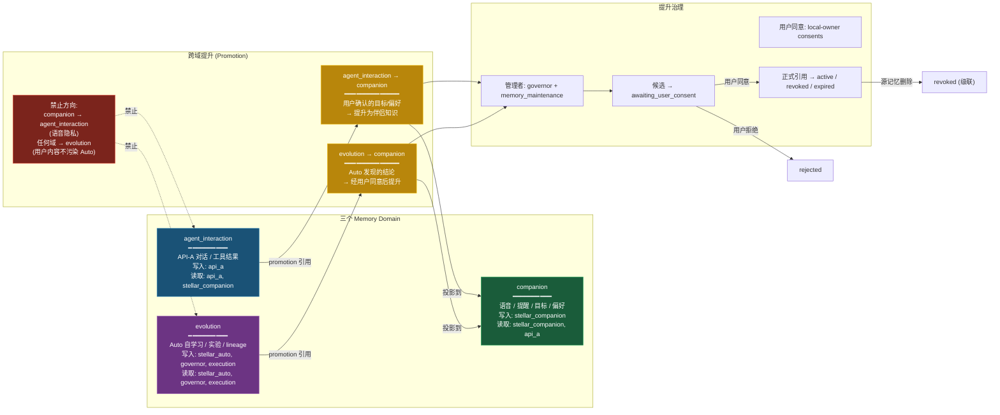
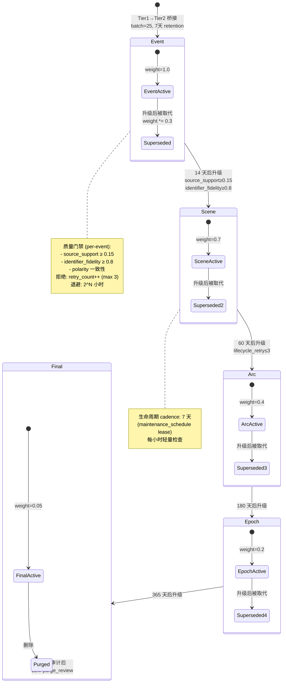
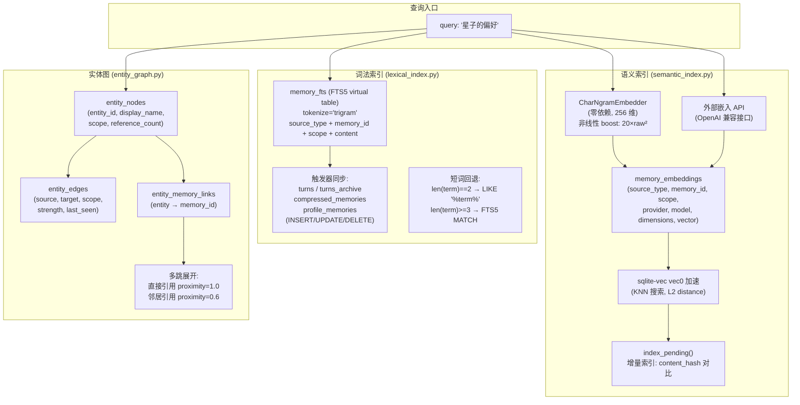
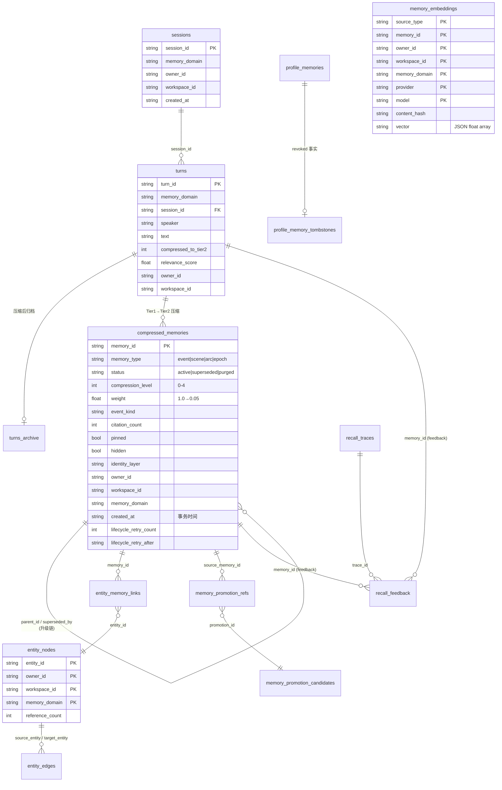
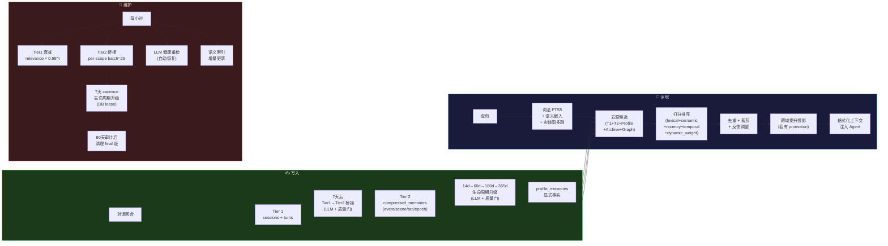

# VoidCube 记忆系统 — 逻辑架构图

> 更新日期：2026-08-05
>
> 基于 `systems/memory/` 26 个模块的当前实现

---

## 一、系统全景

---

## 二、写入数据流（Tier1 → Tier2 → Lifecycle）

---

## 三、召回数据流（读路径）

---

## 四、三域隔离与跨域提升

---

## 五、压缩生命周期状态机

---

## 六、索引体系

---

## 七、维护调度时序

```mermaid
gantt
    title 记忆系统维护调度
    dateFormat HH:mm
    axisFormat %H:%M

    section 每小时循环
    Tier1 Decay (所有 scope)        :decay, 00:00, 2m
    Tier2 Bridge (per scope)        :bridge, 00:02, 5m
    LLM Health Re-check             :health, 00:07, 1m
    Semantic Index Update           :sem, 00:08, 2m

    section 7天 Cadence
    Lifecycle Escalation (lease)    :lifecycle, 00:10, 10m
    Purge Expired                   :purge, 00:20, 2m
    Identity Experience Sync        :identity, 00:22, 1m

    section 按需
    Gateway Registration Check      :gateway, 00:30, 1m
    Backup (成功升级后)              :milestone, backup, 00:30, 2m
```

---

## 八、模块依赖图

```mermaid
graph TB
    subgraph 入口["入口"]
        MS["memory_service.py<br/>★★★ 主服务"]
    end

    subgraph 核心["核心业务"]
        RECALL["recall.py<br/>混合召回引擎"]
        BRIDGE["tier1_to_tier2_bridge.py<br/>Tier1→Tier2 压缩桥接"]
        PROMO["promotion.py<br/>跨域提升管理"]
        PROFILE["profile_capture.py<br/>+ profile_store.py<br/>显式事实管理"]
        LIFECYCLE["lifecycle_policy.py<br/>升级质量策略"]
        MAINT["maintenance.py<br/>+ maintenance_schedule.py<br/>维护调度 + 租约"]
    end

    subgraph 策略["策略 & 配置"]
        CONFIG["config.py<br/>MemoryServiceConfig"]
        DOMAIN["domain.py<br/>MemoryDomain + Actor"]
        SCOPE["scope.py<br/>MemoryScope"]
        RANKING["ranking_policy.py<br/>compute_dynamic_weight"]
        QUALITY["quality_signals.py<br/>质量信号"]
    end

    subgraph 索引["索引"]
        LEX["lexical_index.py<br/>FTS5 词法"]
        SEM["semantic_index.py<br/>向量嵌入"]
        ENT_GRAPH["entity_graph.py<br/>实体图"]
        LOCAL_EMB["local_embedding.py<br/>CharNgramEmbedder"]
    end

    subgraph 基础设施["基础设施"]
        DB["database.py<br/>Schema 引导 + 迁移"]
        BACKUP["backup.py<br/>备份 + 轮转"]
        HTTP["http_adapter.py<br/>FastAPI 路由"]
        MIGRATE["runtime_migration.py<br/>旧版迁移"]
    end

    subgraph LLM["LLM 集成"]
        LLM_EXT["llm_extraction.py<br/>LLM-first 管线"]
        LLM_CACHE["llm_cache.py<br/>结果缓存"]
    end

    subgraph 身份["身份"]
        ID_SEED["identity_seed.py<br/>创始身份"]
        ID_EXP["identity_experience.py<br/>体验同步"]
    end

    MS --> RECALL
    MS --> BRIDGE
    MS --> PROMO
    MS --> PROFILE
    MS --> LIFECYCLE
    MS --> MAINT
    MS --> CONFIG
    MS --> DOMAIN
    MS --> SCOPE
    MS --> BACKUP
    MS --> HTTP
    MS --> DB
    RECALL --> LEX
    RECALL --> SEM
    RECALL --> ENT_GRAPH
    RECALL --> RANKING
    BRIDGE --> LLM_EXT
    BRIDGE --> LLM_CACHE
    BRIDGE --> QUALITY
    BRIDGE --> ENT_GRAPH
    LIFECYCLE --> QUALITY
    SEM --> LOCAL_EMB
    DB --> MIGRATE
    MS --> ID_SEED
    MS --> ID_EXP

    style MS fill:#e94560,stroke:#fff,color:#fff
    style RECALL fill:#4a9eff,stroke:#fff,color:#fff
    style BRIDGE fill:#4a9eff,stroke:#fff,color:#fff
    style CONFIG fill:#53d769,stroke:#fff,color:#000
    style DB fill:#f5c518,stroke:#fff,color:#000
```

---

## 九、关键数据表关系

---

## 十、数据流全貌（简化版）

